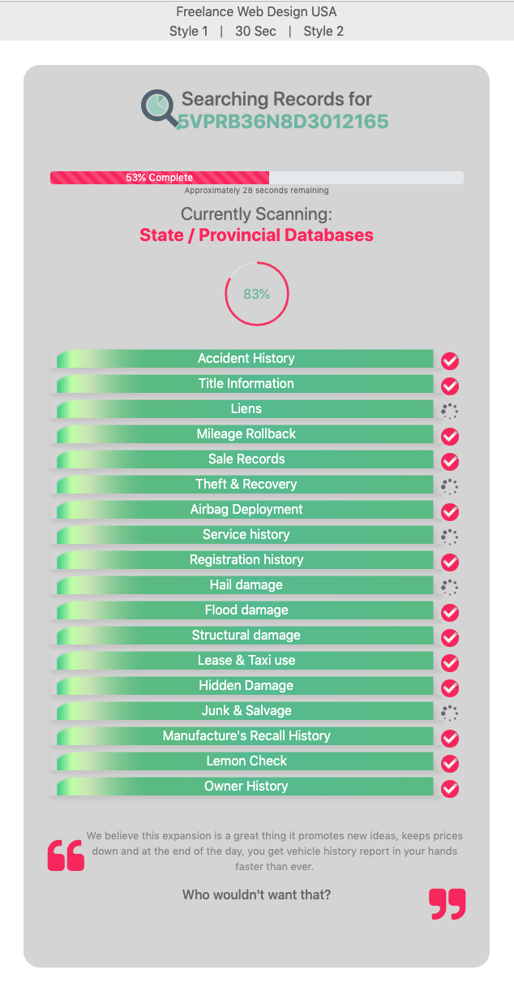

# processing

Responsive page with different types of animations using Javascript and Jquery framework

https://freelancewebdesignusa.com/examples/processingHTML/processing.html

Mobile Version: 

Description:

This page has different processing animations (Digital Counters, Spinners, Processing Bar, Processing Pie..)

<ul>
<<<<<<< HEAD
  <li>Animation Bar Has Digital Percentage Timer Centered Inside</li>
  <li>Digital Timer</li>
  <li>18 Spinners Components</li>
  <li>3 Repeted Fade Texts</li>
  <li>3 Repeated Pie Animations have Circle Timer inside</li>
=======
  <li>Animation Bar has digital counter centered inside</li>
  <li>Digital Counter</li>
  <li>Spinners Components</li>
  <li>3 Repeted Fade Texts</li>
  <li>3 Repeated Pie Animations have digital percentage Counter inside</li>
>>>>>>> daa15d4a129e22121a12c0165181636c54951a2f
</ul>

Responsive using Bootstrap framework

<<<<<<< HEAD
HTML5, #CSS3, #Javascript, #Jquery, #Bootstrap
=======
HTML5, #CSS3, #Javascript, #Jquery, #Bootstrap 

https://freelancewebdesignusa.com/wp-content/themes/freelanewebdesignusa/examples/processingHTML/processing.html
>>>>>>> daa15d4a129e22121a12c0165181636c54951a2f

Development By: freelance Web Design USA
